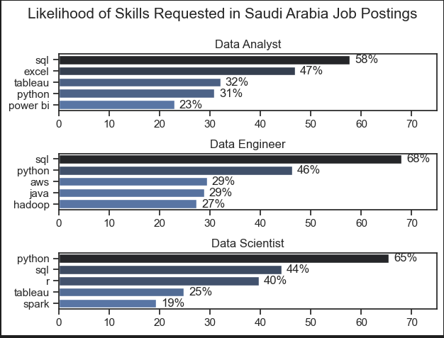

## overviwe

in this project i will analysis and understand the job market , focusing on the data roles . 

The data sourced from Luke Barousse's  " https://huggingface.co/datasets/lukebarousse/data_jobs "

## import & cleanup 

# Importing Libraries
import ast
import pandas as pd
import seaborn as sns
from datasets import load_dataset
import matplotlib.pyplot as plt  

# Loading Data
dataset = load_dataset('lukebarousse/data_jobs')
df = dataset['train'].to_pandas()

# Data Cleanup
df['job_posted_date'] = pd.to_datetime(df['job_posted_date'])
df['job_skills'] = df['job_skills'].apply(lambda x: ast.literal_eval(x) if pd.notna(x) else x)

## 1- what are the most demand skills for the top 3 most popular data rolse in saudi arabia ? 

To better understand what skills are in demand, I started by identifying the top 3 most popular data roles. Once I had those, I looked into the top 5 most requested skills for each role. This helped me get a clear picture of which skills I should focus on, depending on the specific role I'm aiming for.

for more detalied steps :  [2-Skills_count.ipynb](2-Skills_count.ipynb)

## data visualization  

fig, ax = plt.subplots(len(job_titles), 1)

for i, job_title in enumerate(job_titles):
    df_plot = df_skills_perc[df_skills_perc['job_title_short'] == job_title].head(5)
    sns.barplot(data=df_plot, x='skill_percent', y='job_skills', ax=ax[i], hue='skill_count', palette='dark:b_r')
    ax[i].set_title(job_title)
    ax[i].set_ylabel('')
    ax[i].set_xlabel('')
    ax[i].get_legend().remove()
    ax[i].set_xlim(0, 75)
    

    # label the percentage on the bars
    for n, v in enumerate(df_plot['skill_percent']):
        ax[i].text(v + 1, n, f'{v:.0f}%', va='center')

fig.suptitle('Likelihood of Skills Requested in Saudi Arabia Job Postings', fontsize=15)
fig.tight_layout(h_pad=.8)
plt.show()

