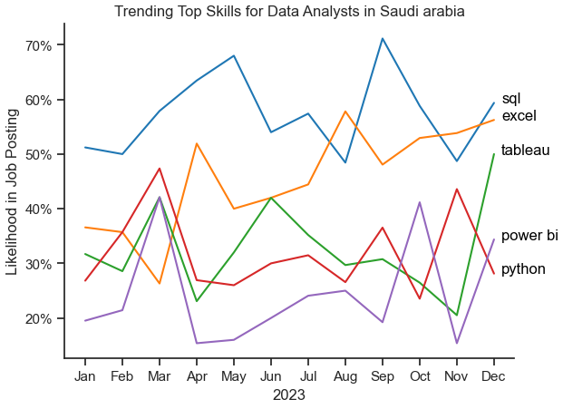
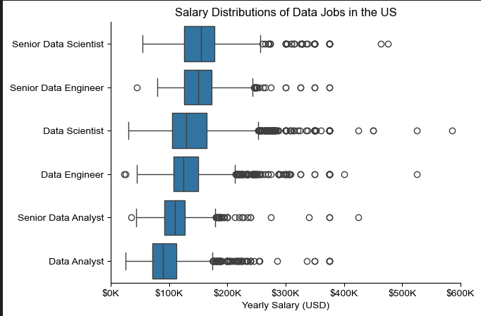

## overviwe

in this project i will analysis and understand the job market , focusing on the data roles . 

The data sourced from Luke Barousse's  " https://huggingface.co/datasets/lukebarousse/data_jobs "


## import & cleanup 

```python
import ast
import pandas as pd
import seaborn as sns
from datasets import load_dataset
import matplotlib.pyplot as plt  

dataset = load_dataset('lukebarousse/data_jobs')
df = dataset['train'].to_pandas()
df['job_posted_date'] = pd.to_datetime(df['job_posted_date'])
df['job_skills'] = df['job_skills'].apply(lambda x: ast.literal_eval(x) if pd.notna(x) else x)

```


## 1- what are the most demand skills for the top 3 most popular data rolse in saudi arabia ? 

To better understand what skills are in demand, I started by identifying the top 3 most popular data roles. Once I had those, I looked into the top 5 most requested skills for each role. This helped me get a clear picture of which skills I should focus on, depending on the specific role I'm aiming for.

for more detalied steps :  [2-Skills_count.ipynb](2-Skills_count.ipynb)


## data visualization  

```python
fig, ax = plt.subplots(len(job_titles), 1)


for i, job_title in enumerate(job_titles):
    df_plot = df_skills_perc[df_skills_perc['job_title_short'] == job_title].head(5)
    sns.barplot(data=df_plot, x='skill_percent', y='job_skills', ax=ax[i], hue='skill_count', palette='dark:b_r')
    ax[i].set_title(job_title)
    ax[i].set_ylabel('')
    ax[i].set_xlabel('')
    ax[i].get_legend().remove()
    ax[i].set_xlim(0, 75)
    

    # label the percentage on the bars
    for n, v in enumerate(df_plot['skill_percent']):
        ax[i].text(v + 1, n, f'{v:.0f}%', va='center')

fig.suptitle('Likelihood of Skills Requested in Saudi Arabia Job Postings', fontsize=15)
fig.tight_layout(h_pad=.8)
plt.show()

```


## 2- what is the trending skills for data analyst based on months 


To understand how skills for Data Analysts evolved in 2023, I focused specifically on job postings for that role and grouped the listed skills by the month they were posted. This gave me a month-by-month view of the top 5 skills, helping me see which ones gained or lost popularity throughout the year.


for more detalied steps :  [3-Skills_trend.ipynb](3-Skills_trend.ipynb)


## data visualization  

```python 
from matplotlib.ticker import PercentFormatter

df_plot = df_percent.iloc[:, :5]
sns.lineplot(data=df_plot, dashes=False, legend='full', palette='tab10')
sns.set_theme(style='ticks')
sns.despine() # remove top and right spines

plt.title('Trending Top Skills for Data Analysts in Saudi arabia')
plt.ylabel('Likelihood in Job Posting')
plt.xlabel('2023')
plt.legend().remove()
plt.gca().yaxis.set_major_formatter(PercentFormatter(decimals=0))

# annotate the plot with the top 5 skills using plt.text()
for i in range(5):
    plt.text(11.2, df_plot.iloc[-1, i], df_plot.columns[i], color='black')

plt.show()
```



- SQL remains the most consistently demanded skill throughout the year, although it shows a gradual decrease in demand.


## 3- 3. How much compnies pay for the data roles in US ? 

note : the dataset provide salaries only for the US other countries is nan 


To figure out which data roles and skills offer the highest pay, I focused on job postings based in the United States and analyzed their median salaries. Before diving into specific skills, I first looked at the salary distributions for common data roles like Data Scientist, Data Engineer, and Data Analyst to get a clear picture of which positions tend to pay the most.


for more detalied steps :  [4-Salaries.ipynb](4-Salaries.ipynb)


```python

sns.boxplot(data=df_top6, x='salary_year_avg', y='job_title_short', order= job_order)
sns.set_theme(style='ticks')
sns.despine()

plt.title('Salary Distributions of Data Jobs in the US')
plt.xlabel('Yearly Salary (USD)')
plt.ylabel('')
plt.xlim(0, 600000) 
ticks_x = plt.FuncFormatter(lambda y, pos: f'${int(y/1000)}K')
plt.gca().xaxis.set_major_formatter(ticks_x)
plt.show()
```



